# MaricáChat

MaricáChat is a real-time chat application built with Django, Channels, and WebSocket. It allows users to register, log in, edit their profiles, access chat rooms, send real-time messages, and more. This project is 100% responsive for mobile devices and is open for contributions.

Portuguese version at the end

## Project Overview

- **Author**: [Matheus dos Reis](https://www.linkedin.com/in/matheus-dos-reis-08b74b1a4/)
- **GitHub**: [Reis567](https://github.com/Reis567)
- **CodePen**: [Reis567 on CodePen](https://codepen.io/reis567)

## Features

- User registration
- User login
- User profile editing
- Access to chat rooms
- Real-time message sending
- Fully responsive for mobile devices

## Technologies Used

- Django (web framework)
- Django Channels (WebSocket support)
- PostgreSQL (database)
- HTML/CSS (user interface)
- JavaScript (WebSocket communication)

## Project Structure

- **`chat/`**: The main application containing models, views, templates, and chat logic.
  - `models.py`: Defines data models such as User, Room, and Message.
  - `views.py`: Defines views for registration, login, profile, chat rooms, etc.
 
- **`ChatProject/consumers.py`**: Handles WebSocket logic using Django Channels.
- **`ChatProject/routing.py`**: Defines routes for WebSocket consumers.
- **`static/`**: Contains static files like CSS and JavaScript.
- **`media/`**: Where user profile images are stored.
- **`templates/`**: Contains HTML templates for the app's pages.

## How to Contribute

This project is open-source and welcomes contributions. Follow the steps below to get started:

1. Fork this repository.
2. Clone the fork to your local environment.
3. Create a branch for your contribution: `git checkout -b my-contribution`
4. Make desired changes.
5. Commit and push changes: `git commit -m "My contribution"`
6. Push to your fork: `git push origin my-contribution`
7. Create a pull request to this original repository.

## Configuration

Make sure to set up your environment with the correct dependencies before running the project.

```bash
# Install Python dependencies
pip install -r requirements.txt

# Configure the PostgreSQL database
# Update settings in settings.py
# Run database migrations
python manage.py migrate

# Start the development server
python manage.py runserver
```

## WebSocket and Channels

Real-time chat functionality is enabled using WebSocket and Channels. The `consumers.py` file handles WebSocket logic, while `routing.py` defines routes for WebSocket consumers. JavaScript on the client communicates with the server through WebSocket to enable real-time messaging.

## Screenshots (Desktop)

Here are some screenshots of the desktop version of the application:

- 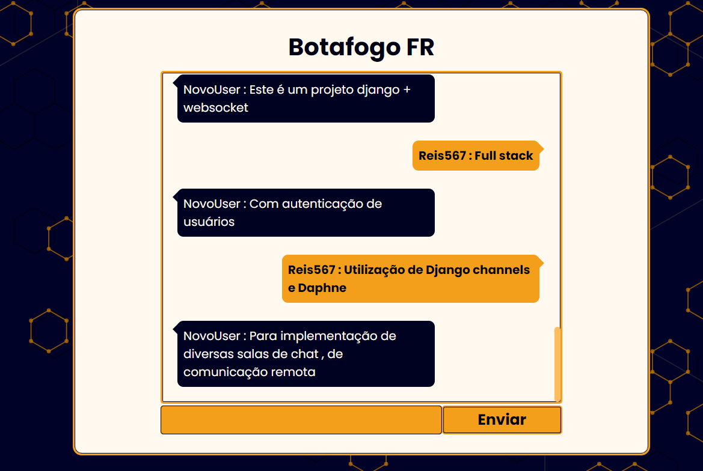
- 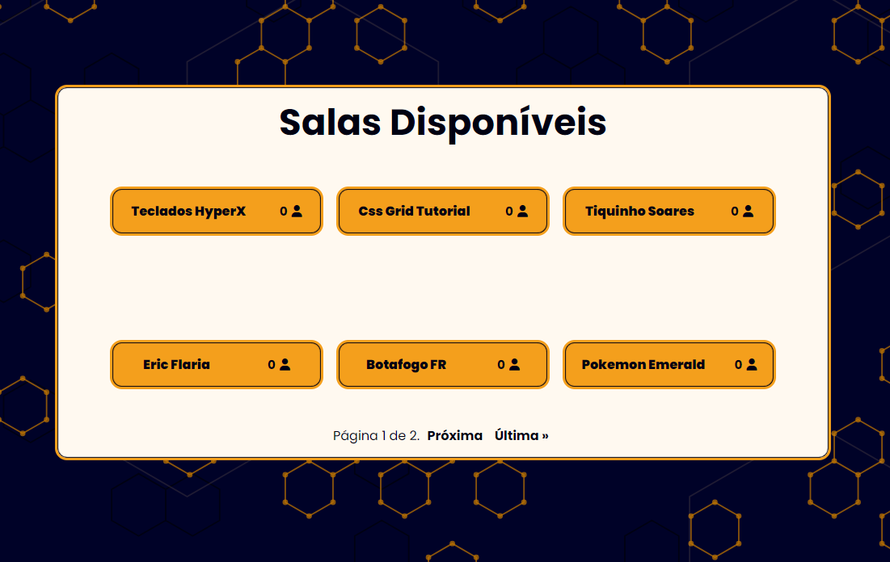
- 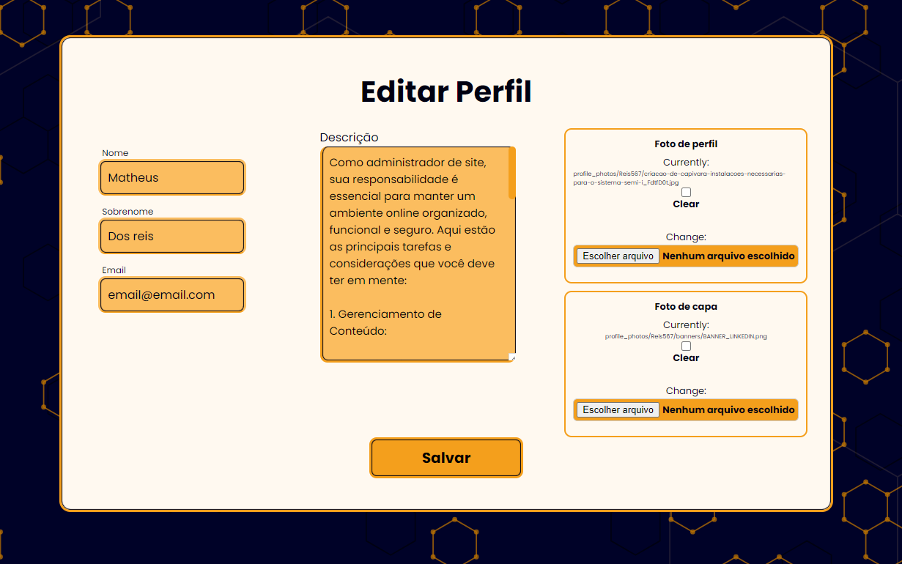
- 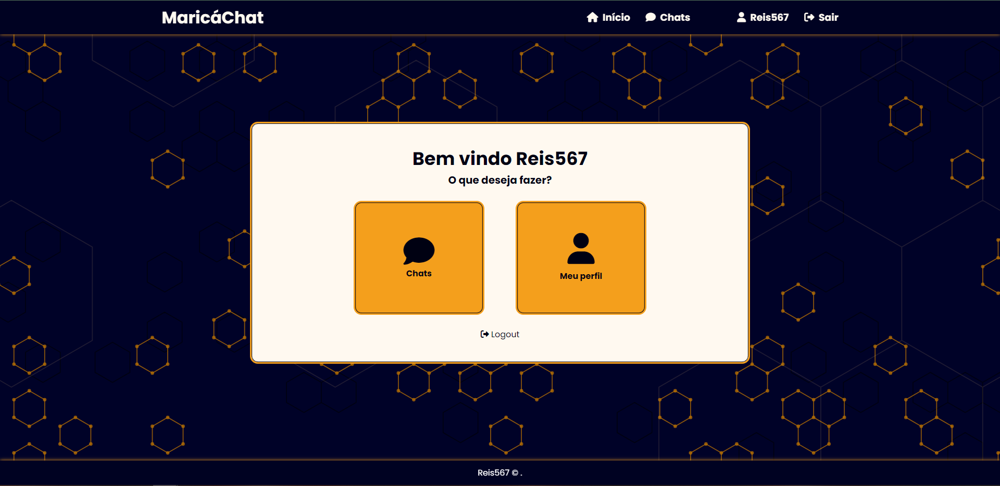
- 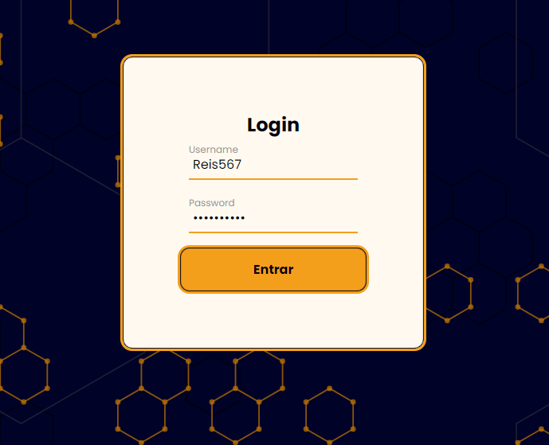
- 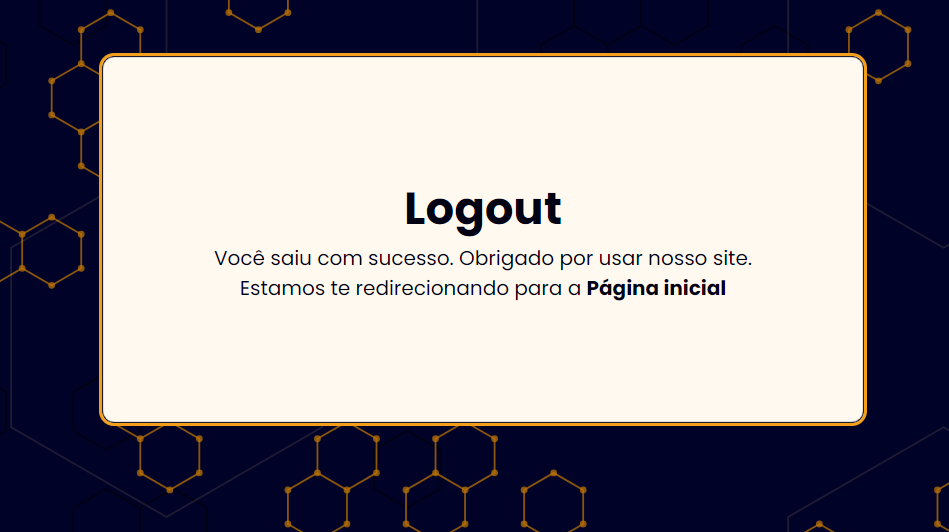
- 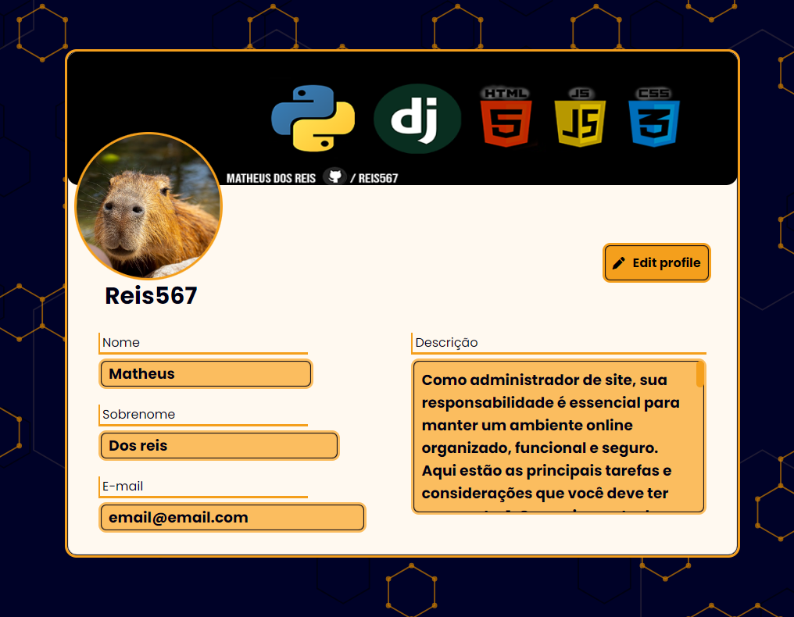
- 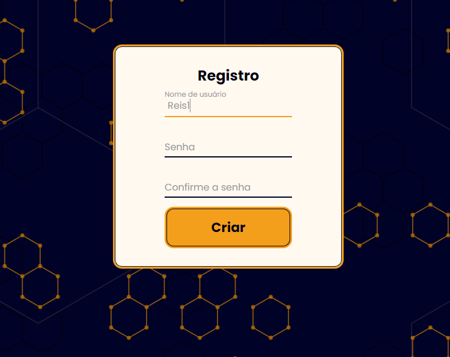

## Screenshots (Mobile)

Here are some screenshots of the mobile version of the application:

- 
- 
- 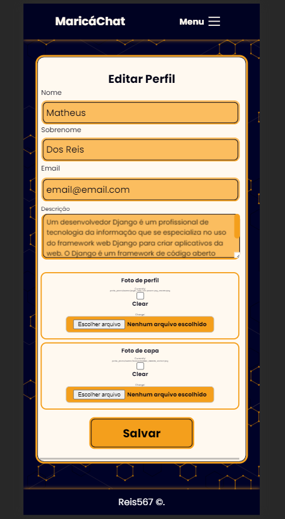
- 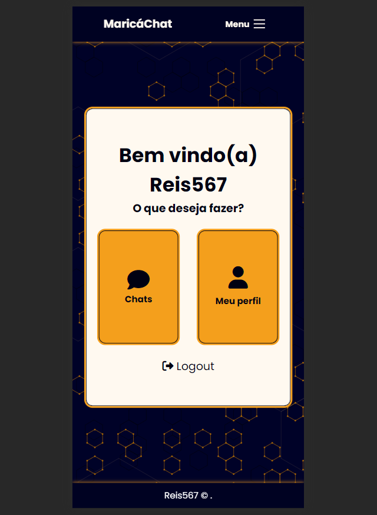
- 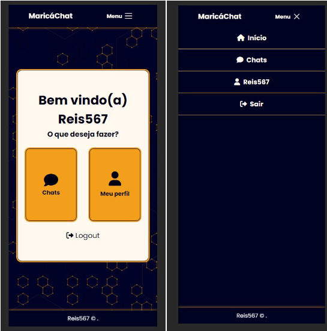
- 
- 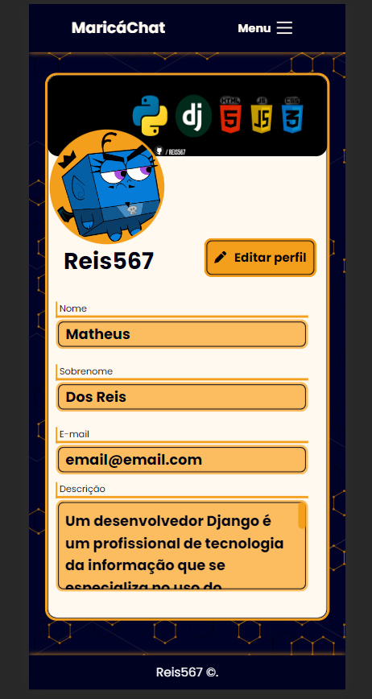
- 

## Português

# MaricáChat

MaricáChat é um aplicativo de chat em tempo real construído com Django, Channels e WebSocket. Ele permite que os usuários se registrem, façam login, editem seus perfis, acessem salas de chat, enviem mensagens em tempo real e muito mais. Este projeto é 100% responsivo para dispositivos móveis e é aberto para contribuições.

## Visão Geral do Projeto

- **Autor**: [Matheus dos Reis](https://www.linkedin.com/in/matheus-dos-reis-08b74b1a4/)
- **GitHub**: [Reis567](https://github.com/Reis567)
- **CodePen**: [Reis567 no CodePen](https://codepen.io/reis567)

## Funcionalidades

- Registro de usuários
- Login de usuários
- Edição de perfil de usuário
- Acesso a salas de chat
- Envio de mensagens em tempo real
- Totalmente responsivo para dispositivos móveis

## Tecnologias Utilizadas

- Django (framework web)
- Django Channels (suporte a WebSocket)
- PostgreSQL (banco de dados)
- HTML/CSS (interface de usuário)
- JavaScript (comunicação WebSocket)

## Estrutura do Projeto

- **`chat/`**: O aplicativo principal que contém os modelos, views, templates e lógica do chat.
  - `models.py`: Define os modelos de dados, como Usuário, Sala e Mensagem.
  - `views.py`: Define as views para registro, login, perfil, salas de chat, etc.
 
- **`ChatProject/consumers.py`**: Lida com a lógica de WebSocket usando Django Channels.
- **`ChatProject/routing.py`**: Define as rotas para WebSocket consumers.
- **`static/`**: Contém arquivos estáticos, como CSS e JavaScript.
- **`media/`**: Onde as imagens de perfil dos usuários são armazenadas.
 - **`templates/`**: Contém os templates HTML para as páginas do aplicativo.

## Como Contribuir

Este projeto é de código aberto e bem-vindo a contribuições. Siga os passos abaixo para começar:

1. Faça um fork deste repositório.
2. Clone o fork para o seu ambiente local.
3. Crie um branch para a sua contribuição: `git checkout -b minha-contribuicao`
4. Faça as alterações desejadas.
5. Commit e envie as alterações: `git commit -m "Minha contribuição"`
6. Faça um push para o seu fork: `git push origin minha-contribuicao`
7. Crie uma pull request para este repositório original.

## Configuração

Certifique-se de configurar seu ambiente com as dependências corretas antes de executar o projeto.

```bash
# Instale as dependências Python
pip install -r requirements.txt

# Configure o banco de dados PostgreSQL
# Atualize as configurações em settings.py
# Execute as migrações do banco de dados
python manage.py migrate

# Inicie o servidor de desenvolvimento
python manage.py runserver
```

## WebSocket e Channels

A funcionalidade de chat em tempo real é habilitada usando WebSocket e Channels. O arquivo `consumers.py` lida com a lógica de WebSocket, enquanto `routing.py` define as rotas para WebSocket consumers. O JavaScript no cliente se comunica com o servidor por meio de WebSocket para permitir mensagens em tempo real.

## Capturas de Tela (Desktop)

Aqui estão algumas capturas de tela da versão para desktop do aplicativo:

- 
- 
- 
- 
- 
- 
- 
- 

## Capturas de Tela (Mobile)

Aqui estão algumas capturas de tela da versão móvel do aplicativo:

- 
- 
- 
- 
- 
- 
- 
- 

